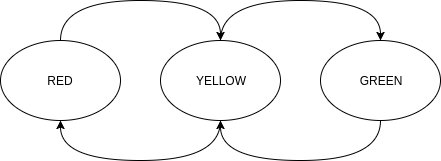

# Minimal ROS package with a `smach` state machine
Minimal working example for defining a new ROS `smach` state machine. More details on service generation can be found
on [ROS documentation for `smach`](http://wiki.ros.org/smach) and the
[`smach` User Data tutorials](http://wiki.ros.org/smach/Tutorials/User%20Data). A few key points from the tutorial:
* A state can be created by extending the base class `smach.State`. Among the extended constructor arguments, the most
important ones are:
    - `input_keys` and `output_keys` specify which fields in user data can be read from and written to
    - `outcomes` specify which state the new state can transition to
* A new state must implement an `execute` method, where state transitions are handled. This method must return one of
the states specified in the `outcomes` constructor argument

## Folder structure
```
.
├── CMakeLists.txt
├── images
│   ├── traffic_light_sm.png
│   └── traffic_light_sm.xml
├── launch
│   └── smach_minimal.launch
├── package.xml
├── README.md
└── scripts
    └── traffic_lights
```

## Foundation course tasks


* add `YELLOW` and `GREEN` states to simulate a traffic light
* add delays in the `execute` functions
* add a field in `userdata` to store previous state (e.g. `prev_state`), and use this to control what's returned from
`execute`, i.e. what will the next state be
* add conditions using the above field so the state transitions are like that in the above figure
* run launch file:
```
roslaunch smach_minimal smach_minimal.launch
```
